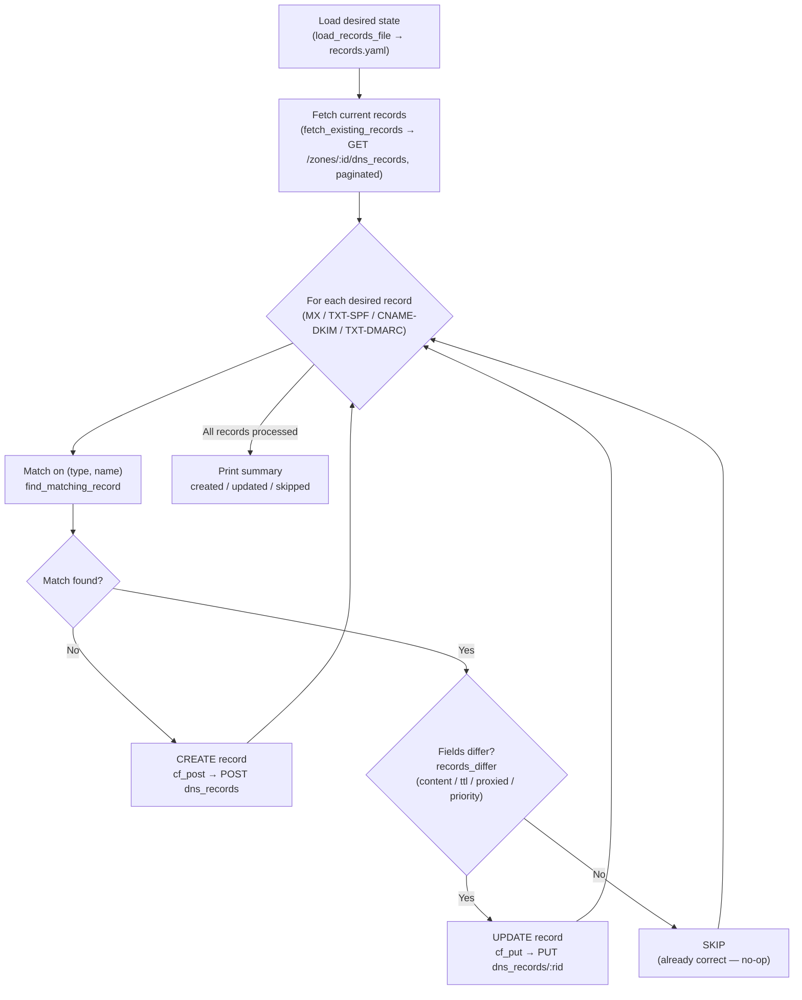

# Cloudflare DNS Automation

A Python command-line tool that manages a domain's DNS records via the **Cloudflare v4 REST API**. Records are declared in a YAML file and the tool idempotently creates or updates them on every run — nothing changes if the records already match.

Built as a homelab project to learn DNS automation, REST API interaction with Python, and the mechanics of email security records (SPF, DKIM, DMARC).

---

## Why This Exists

Managing DNS by hand in a web UI is error-prone and leaves no audit trail. A declarative file checked into version control gives you:

- **Repeatability** — run it again and nothing breaks if it's already correct.
- **History** — git shows every DNS change and who made it.
- **Speed** — onboarding a new domain takes seconds, not clicks.

This pattern mirrors how infrastructure teams use tools like Terraform or Ansible for cloud resources.

---

## Email Security Primer

The three records this tool manages are the foundation of email security. Hiring managers care whether you understand *why*, not just *what*.

### SPF (Sender Policy Framework)

An SPF record is a `TXT` record at the root of your domain (`@`) that lists every IP address or service allowed to send email on your behalf. Receiving mail servers check this record and reject (or flag) mail from unlisted sources.

```
v=spf1 include:_spf.example-mailprovider.com -all
```

- `include:` delegates to another domain's SPF list (e.g., your mail provider's)
- `-all` means "reject anything not explicitly listed" (hard fail)
- `~all` means "soft fail" — flag but don't reject (useful during rollout)

### DKIM (DomainKeys Identified Mail)

DKIM adds a cryptographic signature to outbound emails. Your mail provider holds the private key and signs each message; the public key is published as a `TXT` record (or `CNAME` pointing to your provider's record) in DNS. Receiving servers verify the signature using that public key.

With Cloudflare, most providers give you a `CNAME` to point at their managed key — you never handle the raw key material.

```
mail._domainkey.example.com  CNAME  mail._domainkey.example-mailprovider.com
```

### DMARC (Domain-based Message Authentication, Reporting & Conformance)

DMARC ties SPF and DKIM together and tells receiving servers what to do when checks fail. It also enables **aggregate reports** (`rua`) sent to an address you control, so you can see who is sending email claiming to be your domain.

```
_dmarc.example.com  TXT  "v=DMARC1; p=reject; rua=mailto:dmarc-reports@example.com"
```

- `p=none` — monitor only, take no action (safe starting point)
- `p=quarantine` — send failures to spam
- `p=reject` — block failures outright (production goal)

**Correct deployment order:** SPF → DKIM → DMARC `p=none` → review reports → `p=reject`.

---

## How it works

The tool runs a single idempotent **reconcile loop**: it reads the declared desired state, asks Cloudflare for the current state, diffs the two per record, and only issues a write when something is actually out of sync. Running it twice in a row produces zero changes the second time.



### Step by step

1. **Read desired state.** `load_records_file()` parses and validates `records.yaml` (each record needs `type`, `name`, `content`; top level needs `zone_id` and a `records` list).
2. **Fetch current records.** `fetch_existing_records()` calls `GET /zones/{zone_id}/dns_records` and walks every page (`result_info.total_pages`) so the diff sees all records, not just the first page.
3. **Diff per record.** For each desired record, `find_matching_record()` looks for an existing record with the same `(type, name)`. `records_differ()` then compares only the fields this tool manages — `content`, `ttl` (Cloudflare's "Auto" is `1`), `proxied`, and `priority` (for `MX`/`SRV`/`URI`) — ignoring server-managed fields like `id` and `modified_on`.
4. **Create / update / skip.** Based on the diff, `upsert_record()` returns one of three outcomes:
   - no match → **CREATE** via `cf_post()` (POST)
   - match but fields differ → **UPDATE** via `cf_put()` (Cloudflare replaces the record by ID with PUT, not PATCH)
   - match and identical → **SKIP** (the no-op path that makes repeated runs safe)
5. **Summarize.** The loop tallies `created` / `updated` / `skipped` and prints the totals. With `--dry-run`, steps 1–3 still run, but the POST/PUT calls in step 4 are skipped so you can preview the plan.

The email-security records flow through the same loop using their native Cloudflare types: **SPF** and **DMARC** are `TXT` records, **DKIM** is a `CNAME` to the provider's published key, and mail routing uses `MX` records (which carry a `priority`).

---

## Project Structure

```
cloudflare-dns-automation/
├── dns_manager.py        # Main script
├── records.example.yaml  # Declarative desired-state (copy to records.yaml)
├── .gitignore
└── README.md
```

---

## Prerequisites

- Python 3.9+
- A Cloudflare account with at least one domain (zone)
- A Cloudflare **API Token** with `Zone:DNS:Edit` permission for the target zone

Install the one non-stdlib dependency:

```bash
pip install requests
```

---

## Configuration

### 1. Set your API token as an environment variable

The token is **never stored in code or files**. Export it in your shell:

```bash
export CLOUDFLARE_API_TOKEN="your-token-here"
```

Or create a `.env` file (excluded by `.gitignore`) and source it:

```bash
# .env  — NEVER commit this file
CLOUDFLARE_API_TOKEN=your-token-here
```

```bash
source .env  # or use `python-dotenv` if you prefer
```

### 2. Copy and edit the records file

```bash
cp records.example.yaml records.yaml
# Edit records.yaml with your real zone ID and desired records
```

Find your **Zone ID** in the Cloudflare dashboard under your domain's Overview tab (right sidebar).

---

## Usage

### Dry run (no changes made)

Always run with `--dry-run` first to preview what would change:

```bash
python dns_manager.py --records records.yaml --dry-run
```

### Apply changes

```bash
python dns_manager.py --records records.yaml
```

### Full usage

```
usage: dns_manager.py [-h] --records RECORDS [--dry-run] [--verbose]

options:
  -h, --help         show this help message and exit
  --records RECORDS  Path to the YAML records file
  --dry-run          Print planned changes without applying them
  --verbose          Print full API responses
```

---

## Security Notes

- **API token scope:** Generate a token with *only* `Zone:DNS:Edit` on the specific zone. Never use your Global API Key.
- **Token storage:** The token lives in `CLOUDFLARE_API_TOKEN` only — not in code, not in YAML, not in git.
- **`.gitignore`** excludes `.env` and `records.yaml` (which may contain your real zone ID).
- Cloudflare tokens can be rotated in the dashboard at any time under **My Profile → API Tokens**.

---

## Skills Demonstrated

| Area | What this project shows |
|---|---|
| DNS | SPF, DKIM, DMARC, MX — what they are and why they're ordered the way they are |
| REST APIs | Authenticated requests, pagination, CRUD via `requests` |
| Python | Argparse, YAML parsing, error handling, clean module structure |
| Automation | Idempotency — safe to run repeatedly with no side effects |
| Security | Env-var-only secrets, least-privilege API tokens |
| IaC mindset | Declarative desired-state file, version-controllable configuration |
